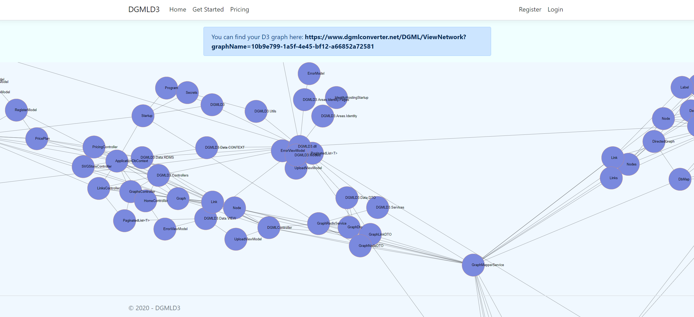

# DGML Converter

Easily convert from your DGML file generated by Visual Studio to a shareable link.

Makes it easy for devlopers to share knowledge. Conveniently allows you to visualize large code bases.

Try here: https://www.dgmlconverter.net/DGML/Upload

### Tech Used:

#### Lanagues

- C# .Net Core 3.1 - ASP.NET MVC
- JavaScript - JQuery - D3.JS

#### Data Stores

- PostgreSQL - Main Data Store
- Redis - For Reads of Graphs

#### Screen Shot 1

### Hosted on Digital Ocean Using Docker & Docker Swarm
